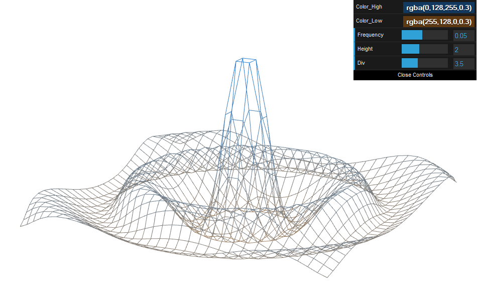
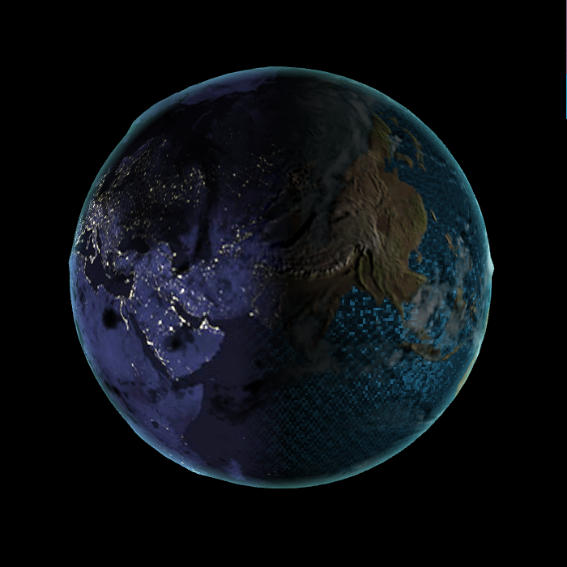
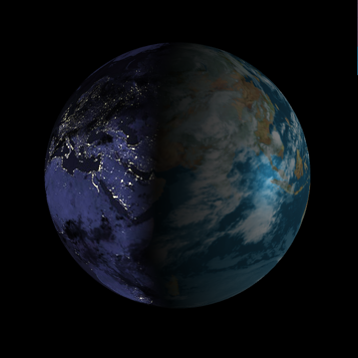
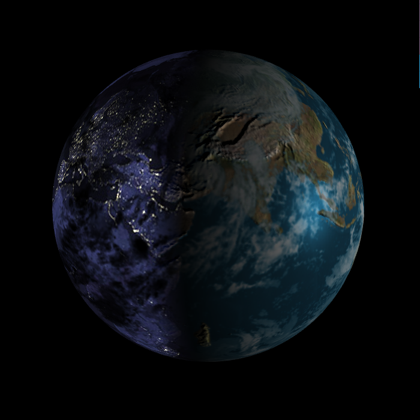
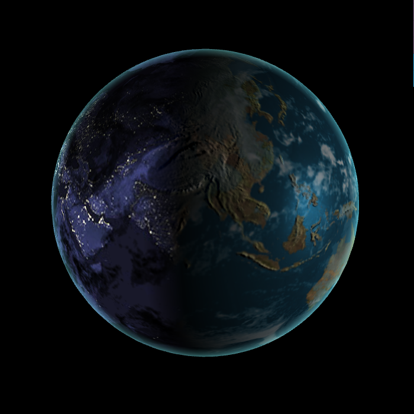
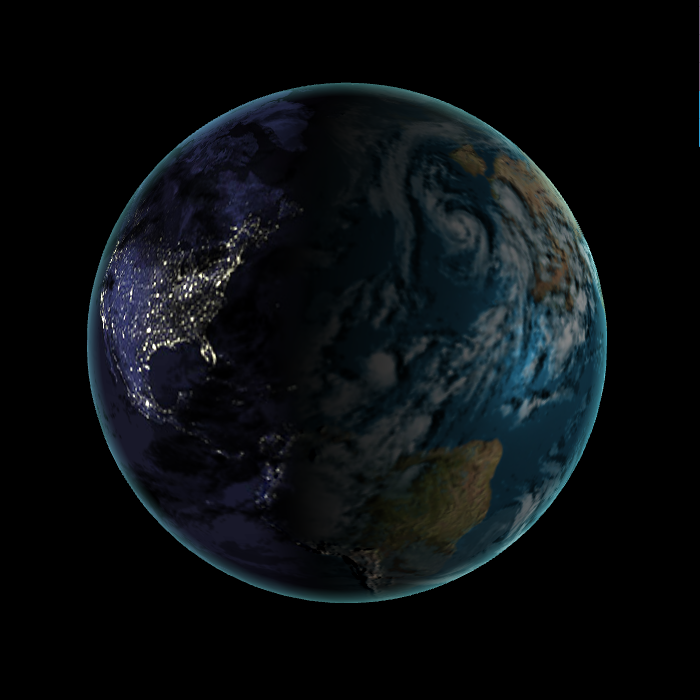
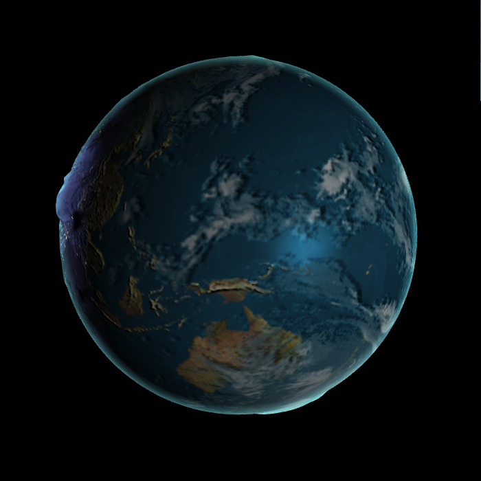
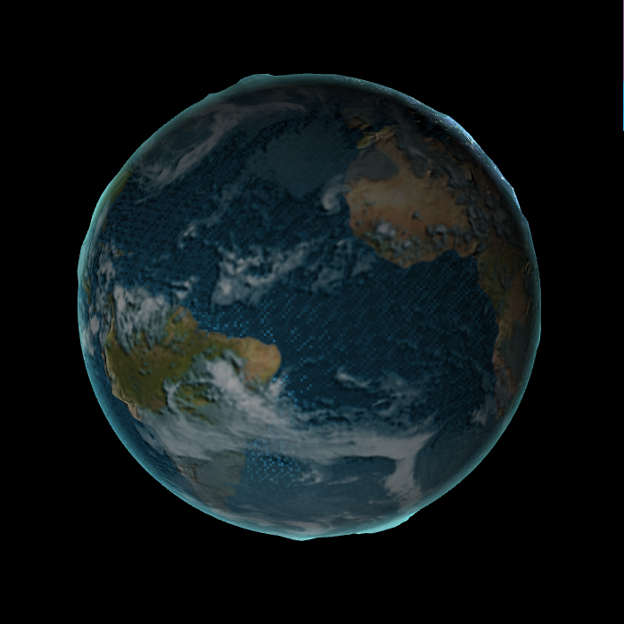
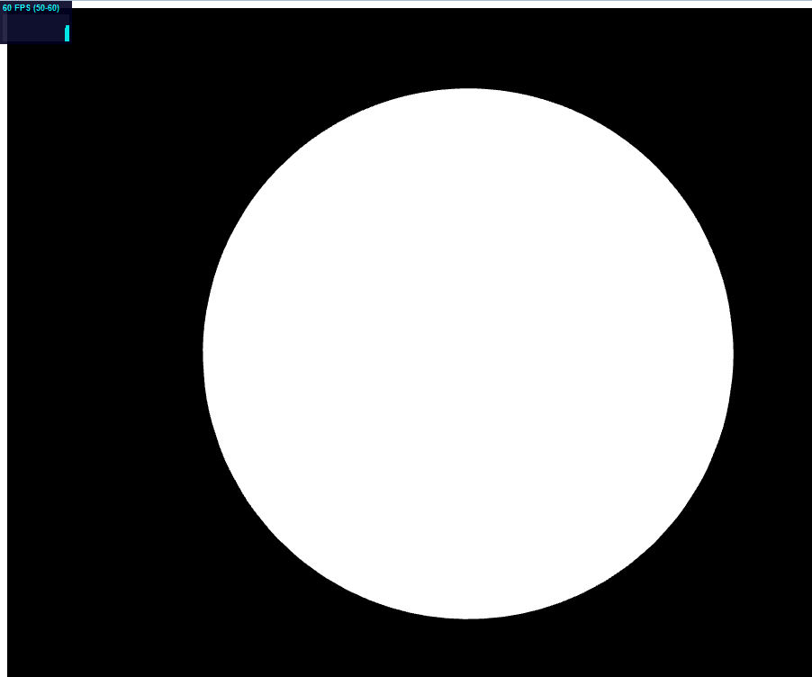

#Part 1 Sin Wave
Using Color_High to set the color for the highest point.
Using Color_Low to set the color for the lowest point.
Using Frequency to set the vibration speed.
Using Height to set the height of the highest point.
Using Div to set different vibration mode.
The center point of the grid will vibrate following a cos function. The surround points also vibrate following the cos function, 
however there is time offset and the height decreases as the distance to the center point increases.

#Part 2 Globe
Basic fatures:
* Rim Light
* Specular on water
* Bump mapping
Extra fatures:
* Clouds shadow
* Height shade
* Water rendering

**Initial mappint**

**Bump mappint effect**

**Rim light effect**

**Clouds Shadow**
According to the light direction to offset the cloud's map and use the cloud's map to cover the color behind the could.

**Height Shade**
Using bump map to set the vertex shader. I ever tried to set the vertex shader according to the real earth radius ratio. 
However, the radius of earth is 6400 km and the highest mountain on earth is 8.8km. That means if I really set the vertex
shader according to the real ratio, we could almost see nothing difference. Therefore, the current ratio is not real.

**Water Rendering**

#Performance Analysis
Actually, I can't find any FPS difference between the fragment shader with full effects and the fragment shader without any effect.
From the image below we could see that even I just directly assign the fragment color to (1,1,1) 
without any calculation, the FPS is still 60 which is the same with which with full effects.  
I also ever tried to create more vertices when building the sphere, but the FPS is still 60. 

#Video
http://youtu.be/NRenJzGajc0
